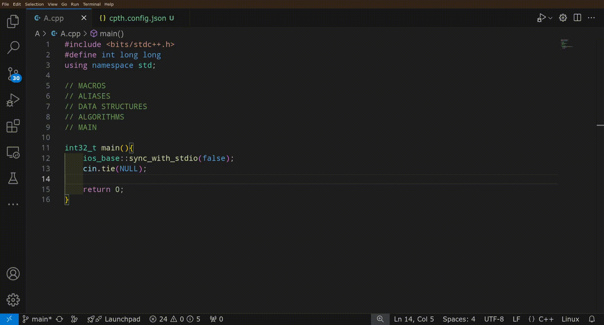

# CP Template Helper
[](https://github.com/SYCKGit/CPTH)
[](https://marketplace.visualstudio.com/items?itemName=OviyanGandhi.cp-template-helper)

A Visual Studio Code extension to effortlessly import your competitive programming templates!



## Getting Started

To get started, create a `cpth.config.json` file in the folder containing your competitive programming files.
You can use the file to provide information about your templates.
Here is an example configuration which defines the `pii` template:

```json
{
  "templates": [
    {
      "name": "pii",
      "template": "typedef pair<int, int> pii;"
    }
  ]
}
```

To use the extension in your code, you must have the following in it:
```cpp
// MACROS
// ALIASES
// DATA STRUCTURES
// ALGORITHMS
// MAIN
```
These comments are used by the extension to figure out where to insert templates.

> **TIP:** You can also use the `cpth` snippet to add these to your code.

## Defining Templates
There are two ways to define templates:

### 1. Templates Inside The Config File
You can directly define the templates inside the config file in the `templates` array, as shown above in the getting started section.
The templates array takes objects which have the following properties:
- **name (required)**: The name of the template.
- **template (required)**: The content of the template. This can either be a string (representing the full content of the template) or an array of strings (representing the individual lines of the template).
- **type**: The type of the template, which can be one of:
  - **alias** [default] (`typedef`, `using`, etc.)
  - **macro** (`#define`)
  - **ds** (`class`, `struct`, etc.)
  - **algo** (function)
- **requires**: An array of other templates that the template uses.

### 2. Templates As Their Own Files

You can put templates in their own separate files. In a template file,
- The first line should be `// @template TemplateName`, where `TemplateName` is the name of your template.
- If the template uses other templates, the second line should start with `// @requires`, followed by the required templates, separated by commas. For example, `// @requires SegTree, vi, pii`
- A marker comment should be placed in the file to indicate the start of the template. This comment can either be `// START DATA STRUCTURE` or `// START ALGORITHM`. Any code in the file after this marker will be included in the template content.

> **TIP:** You can also use the `tcpth` snippet to add these to your template file.

> **NOTE:** You can only define one template in one file. You cannot define aliases in separate files.

For the extension to use your template file, you must add it to the `includes` property of your config file. Example:
```json
{
  "includes": [ "segtree.cpp", "dijkstra.cpp" ]
}
```

You can also put folders in the `includes` property to add all the template files inside them.

## Sharing Templates
You can easily share your configuration files with others. To add other configurations to your config file, you can list their files in the `extends` property.

> **NOTE:** Any file path you put in the `includes` or `extends` array in a config file must be relative to the location of that config file.